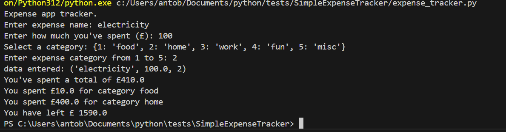
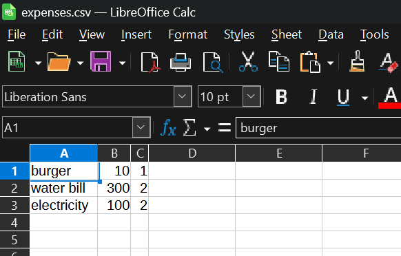

# pythonPracticeExpenses

This is just a simple exercise to familiarize with python syntax.

The project is a simple expenses track console app that tracks the expenses, save them to a csv file on the hard drive.

It's a rework of this that I used as inspiration https://github.com/pixegami/python-for-beginners

## Tests
The most important bits here are the tests that were not in the original project, see link above.

## Sample run
A sample run looks like this:

The CSV:

